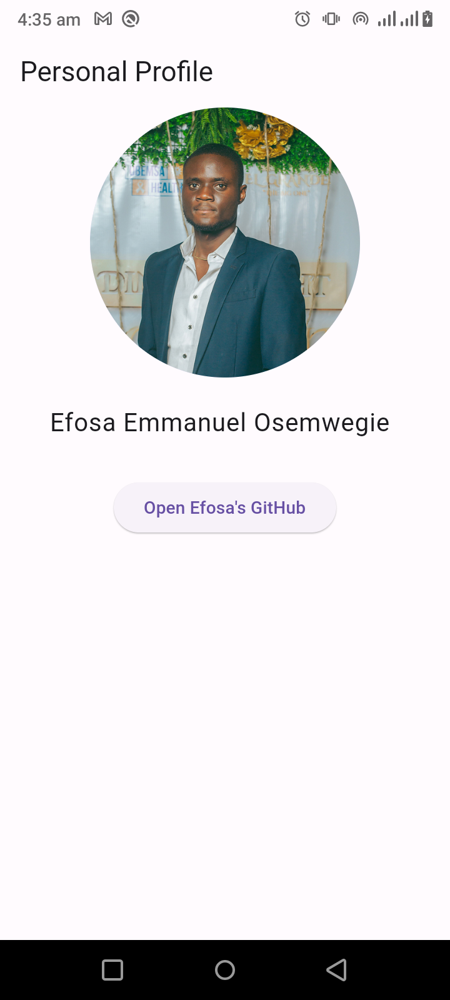
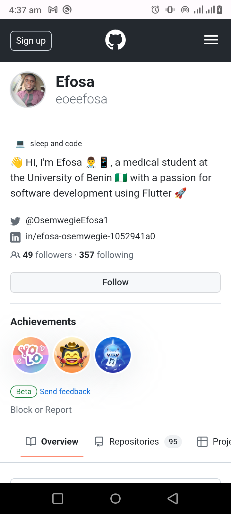

# personal_details

[App demo on Apetize](https://appetize.io/app/7duimm4ojjibgbuqrjib7fr7em?device=pixel7&osVersion=13.0&scale=75)

## Task: Create a Mobile Application with Personal Details

Objective: Create a mobile application that prominently features your Slack identity, incorporates your Slack profile picture, and includes an “Open GitHub” button. When pressed, this button should utilize a WebView component to redirect users to your GitHub profile within the application itself.

## Requirements:
1. **Slack Name**: The application’s main screen should prominently display your Slack name.
2. **Display Picture**: Integrate your Slack display picture onto the main screen, ensuring it’s clear and of high quality.
3. **Open GitHub Button**: Add a button labeled “Open GitHub” to the main screen. When pressed, it should correctly redirect users to your GitHub profile using a WebView component within the application.

## Acceptance Criteria:
1. **Minimal Third-party Dependencies**: Ensure the application is developed with minimal use of third-party packages, plugins, or libraries. You are allowed to use third party dependencies but try to utilize only native functionalities and components of your selected mobile platform when you can.
2. **Intuitive UI**: Create an application with a user-friendly and intuitive interface, featuring clear labelling and easy navigation.
3. **Responsiveness**: Ensure the application is responsive, providing a seamless experience across various device sizes.
4. **Functionality**: Verify that the “Open GitHub” button functions correctly, opening the specified GitHub profile within the application’s WebView.

